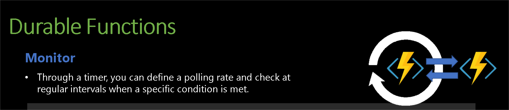

# Monitor in Azure Durable Functions

The Monitor pattern in Azure Durable Functions is used to implement periodic checks or recurring tasks within a workflow. This pattern is particularly useful for scenarios where you need to wait for a certain condition to be met or repeatedly perform an action until a specific state is achieved.

## Key Features of the Monitor Pattern

- Periodic Check: The orchestrator function periodically checks the status of a condition or resource.
Wait and Retry: If the condition is not met, the orchestrator waits for a specified duration before checking again.
- State Persistence: The state of the orchestrator is saved after each wait, allowing the function to be resilient to restarts or failures.
- Timeout Handling: The monitor can be configured to give up after a certain period, ensuring that it does not run indefinitely.

reach out if you need any help with this example (rpinto@pdragon.co)
