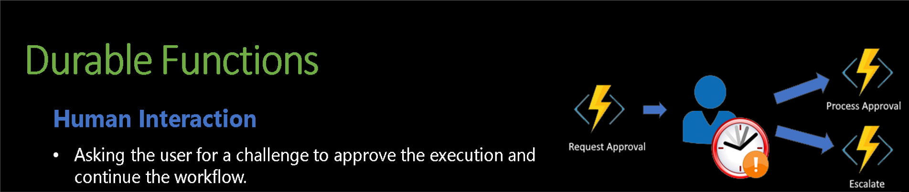

# HumanInterAction in Azure Durable Functions

The Human Interaction pattern in Azure Durable Functions is designed to handle workflows that require manual intervention or approvals as part of the automated process. This pattern allows the orchestration of workflows where certain steps must wait for human input before proceeding.

## Key Features of the Human Interaction Pattern

- Wait for External Events: The orchestrator function can wait for external events, such as human approvals or inputs, before continuing with the workflow.
- Long-Running and Resilient: The workflow remains durable and can survive restarts and failures, as the state is persisted by the Durable Task Framework.
- Timeouts and Escalations: The orchestrator can include logic to handle situations where the human interaction does not occur within a specified time, triggering alternative actions or escalations.
State Persistence: The state of the workflow, including the point at which it is waiting for human interaction, is persisted, allowing it to resume accurately even after disruptions.

reach out if you need any help with this example (rpinto@pdragon.co)
