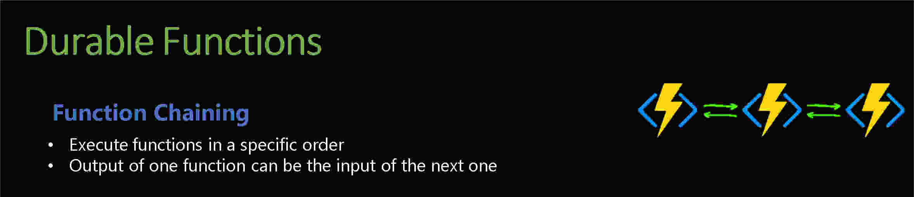

# Function chaining in Azure Durable Functions

Function chaining in Azure Durable Functions is a powerful pattern used to define workflows where each function execution depends on the output of the previous one. In PowerShell, this pattern allows for the orchestration of a series of functions, creating a flow where each step processes data and passes it to the next step. Here’s how to implement and understand the function chaining pattern using Azure Durable Functions in PowerShell.

Key Concepts
Orchestrator Function: Manages the workflow by invoking activity functions in a specific order.
Activity Functions: Perform discrete tasks and return results to the orchestrator.
Durable Task Framework: Ensures reliability and state management across function executions.

reach out if you need any help with this example (rpinto@pdragon.co)
