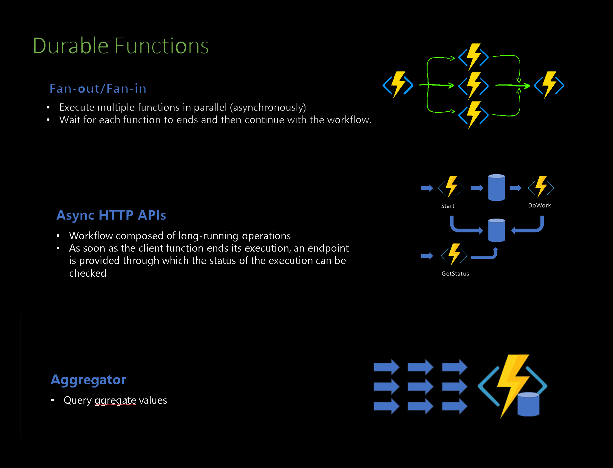

# FanOutFanin + Async calls + Aggregator  in Azure Durable Functions

## Fan-Out/Fan-In Pattern:

This pattern is used to execute multiple tasks in parallel and then aggregate their results once all tasks are completed.

- Fan-Out Phase: The orchestrator function initiates multiple instances of an activity function concurrently. Each instance can run independently and perform its specific task.
- Fan-In Phase: The orchestrator function waits for all activity functions to complete and then aggregates their results. This phase ensures that all parallel tasks are completed before any further processing.

## Asynchronous Function Calls:

In Azure Durable Functions, asynchronous function calls allow the orchestrator to start tasks that run independently of the orchestrator’s execution thread. This helps in efficiently managing long-running operations without blocking the orchestrator.

- Non-blocking Execution: The orchestrator can initiate an activity function and proceed with other operations without waiting for the activity to complete.
- Checkpointing: The Durable Task Framework handles checkpointing the state of the orchestrator function, allowing it to resume from the last checkpoint if interrupted.

## Aggregator Pattern:

The Aggregator pattern is used to combine results from multiple tasks into a single cohesive result. This is particularly useful in the Fan-Out/Fan-In pattern where multiple parallel tasks need to be aggregated.

- Collecting Results: After all parallel tasks in the Fan-Out phase are completed, the orchestrator function gathers the results from each task.
- Processing Aggregated Data: The orchestrator then processes these collected results to produce a final output. This could involve combining data, performing calculations, or summarizing information.

reach out if you need any help with this example (rpinto@pdragon.co)
