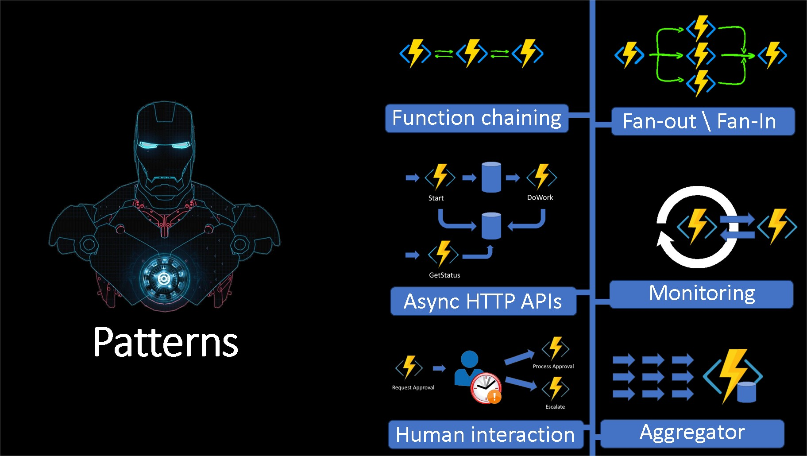

# Azure Durable Functions - PowerShell Development Baseline

This isa repository that contains a baseline for helping the development process with Azure Durable Functions in PowerShell. 

The repository includes examples of the most common patterns used in Durable Functions, such as:

- Simple Durable Functions
- Function Chaining
- Fan-out/Fan-in
- Monitor Pattern
- Human Interaction
- Aggregator Pattern
- External Events

## Tips and tricks

- Adjust Tooling (Dev/Prod)!
- Orchestrator and Activities Naming Convention
- Activities return is serialized 
- Avoid using Durable Function storage account for something else
- Don’t perform any computation in orchestrator otherwise it will run it multiple times.
- Always give a name to your Orchestrations Instance Ids
- Keep function inputs and outputs as small as possible
- Multiple params? 1 Composed Parameter
- Think Microservices !
- Deployment ! (#bicep)
- Lock your PowerShell Modules Versions (Azure, PnP.PowerShel, etc)
- When possible, use managed identities

Feel free to reach out to me if you have any questions !

email:rpinto@pdragon.co
twitter:@scoutmanpt
linkedin:https://www.linkedin.com/in/rodrigomgpinto

 
